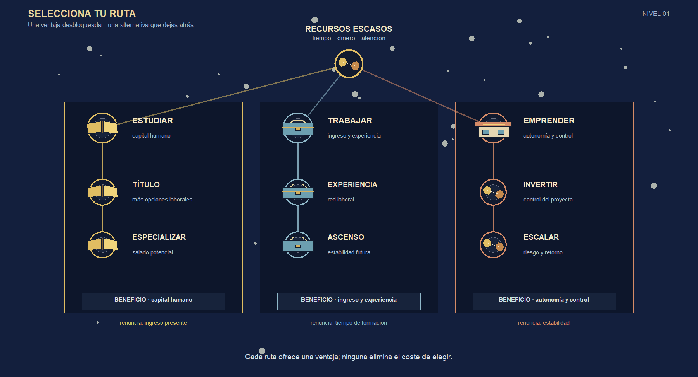
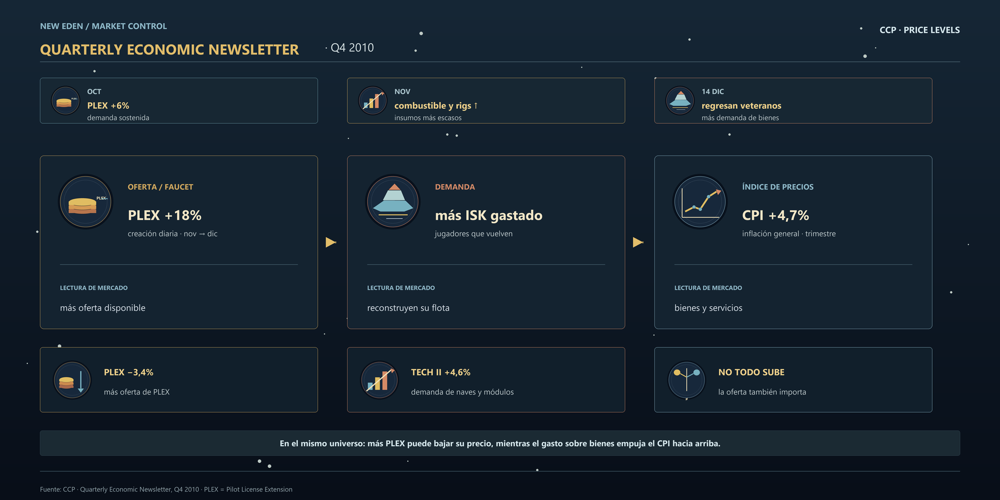

<style>
.game-visual {
  margin: 1.25rem 0 2.4rem;
}

.game-visual-title {
  color: #d8b66a;
  font-size: .78rem;
  letter-spacing: .16em;
  text-transform: uppercase;
  margin-bottom: .45rem;
}

.game-visual-subtitle {
  color: #c9c0ae;
  font-size: .95rem;
  margin-bottom: .8rem;
}

.constellation-wrap,
.market-wrap {
  border: 1px solid #5d5a4e;
  box-shadow: 8px 8px 0 rgba(38, 37, 31, .16);
}

.constellation-wrap {
  background: #0b1020;
  overflow: hidden;
}

.constellation-svg {
  display: none;
  width: 100%;
  height: auto;
}

.constellation-raster {
  display: block;
  width: 100%;
  height: auto;
}

.market-wrap {
  background: #171b19;
  color: #f2e5cf;
  padding: 1rem;
}

.market-topbar {
  display: flex;
  align-items: center;
  justify-content: space-between;
  gap: 1rem;
  border-bottom: 1px solid #54584b;
  padding: .25rem .25rem .8rem;
  margin-bottom: 1rem;
}

.market-title {
  color: #e4bb69;
  letter-spacing: .12em;
  font-size: .8rem;
  font-weight: 800;
}

.market-wallet {
  color: #e4bb69;
  font-variant-numeric: tabular-nums;
  font-weight: 700;
}

.coin-icon {
  display: inline-block;
  width: .9em;
  height: .9em;
  border: 2px solid #e4bb69;
  border-radius: 50%;
  box-shadow: inset 0 0 0 2px #6e5931;
  vertical-align: -.08em;
  margin-right: .2em;
}

.market-states {
  display: grid;
  grid-template-columns: 1fr auto 1fr auto 1fr;
  align-items: center;
  gap: .7rem;
}

.market-state {
  min-height: 280px;
  background: #232923;
  border: 1px solid #68705d;
  padding: .9rem;
  position: relative;
}

.market-state.warn { border-color: #b85c38; }
.market-state.good { border-color: #5f8297; }

.state-label {
  color: #d9d0bf;
  font-size: .7rem;
  letter-spacing: .1em;
  text-transform: uppercase;
}

.state-wallet {
  color: #e4bb69;
  font-size: 1.35rem;
  font-weight: 800;
  margin: .75rem 0 1rem;
}

.inventory-slot {
  display: flex;
  align-items: center;
  justify-content: space-between;
  background: #111610;
  border: 1px solid #4c5548;
  padding: .7rem;
  margin-bottom: .7rem;
}

.item-name { color: #f2e5cf; font-weight: 700; }
.item-quantity { color: #aeb795; font-variant-numeric: tabular-nums; }

.price-tag {
  display: inline-block;
  background: #d7b25e;
  color: #2c2b23;
  padding: .35rem .55rem;
  font-weight: 800;
  font-variant-numeric: tabular-nums;
}

.market-state.warn .price-tag { background: #c66b47; color: #fff2e7; }
.market-state.good .price-tag { background: #6f95aa; color: #101b20; }

.state-foot {
  color: #aeb3a5;
  font-size: .78rem;
  position: absolute;
  bottom: .8rem;
  left: .9rem;
  right: .9rem;
}

.state-arrow {
  color: #d8b66a;
  font-size: 1.45rem;
  text-align: center;
}

.market-formula {
  border-top: 1px solid #54584b;
  color: #d9d0bf;
  font-size: .82rem;
  margin-top: 1rem;
  padding-top: .8rem;
  text-align: center;
}

.eve-wrap {
  display: none;
  background: #111a24;
  border-color: #4c6672;
  color: #e6edf0;
  padding: 1.1rem 1.25rem .95rem;
  box-shadow: 8px 8px 0 rgba(20, 33, 41, .22);
}

.eve-topbar {
  display: flex;
  justify-content: space-between;
  align-items: flex-start;
  gap: 1rem;
  border-bottom: 1px solid #3f5661;
  padding-bottom: .75rem;
}

.eve-kicker,
.eve-badge,
.eve-node-label {
  color: #91b9c9;
  font-size: .62rem;
  letter-spacing: .14em;
  text-transform: uppercase;
}

.eve-title {
  color: #e2bd6a;
  font-size: 1.05rem;
  font-weight: 800;
  letter-spacing: .06em;
  margin-top: .2rem;
}

.eve-title span { color: #d5dfe3; font-weight: 500; }

.eve-badge {
  border: 1px solid #668697;
  color: #d5e7ed;
  padding: .3rem .45rem;
  white-space: nowrap;
}

.eve-timeline {
  display: grid;
  grid-template-columns: repeat(3, 1fr);
  gap: .6rem;
  margin: 1rem 0;
}

.eve-event {
  border-left: 3px solid #718e9b;
  background: #192631;
  padding: .55rem .7rem;
}

.eve-event.hot { border-left-color: #c66b47; }
.eve-event span,
.eve-event strong,
.eve-event small { display: block; }
.eve-event span { color: #9eb7c1; font-size: .62rem; letter-spacing: .12em; }
.eve-event strong { color: #f0d08a; font-size: .82rem; margin: .15rem 0; }
.eve-event small { color: #b9c5c8; font-size: .72rem; }

.eve-flow {
  display: grid;
  grid-template-columns: 1fr auto 1fr auto 1fr;
  align-items: center;
  gap: .7rem;
}

.eve-node {
  min-height: 125px;
  border: 1px solid #587383;
  background: #17232d;
  padding: .8rem;
  display: flex;
  flex-direction: column;
  justify-content: center;
}

.eve-node.faucet { border-color: #c4a65a; }
.eve-node.demand { border-color: #c66b47; }
.eve-node.outcome { border-color: #8eb8c8; }
.eve-node strong { color: #f3e7c7; font-size: 1.12rem; margin: .45rem 0 .25rem; }
.eve-node small { color: #b9c5c8; line-height: 1.35; font-size: .75rem; }
.eve-connector { color: #e2bd6a; font-size: 1.7rem; text-align: center; }

.eve-results {
  display: grid;
  grid-template-columns: repeat(3, 1fr);
  gap: .6rem;
  border-top: 1px solid #3f5661;
  margin-top: 1rem;
  padding-top: .75rem;
}

.eve-results div { padding: .2rem .5rem; border-left: 2px solid #718e9b; }
.eve-results div:first-child { border-left-color: #c4a65a; }
.eve-results div:nth-child(2) { border-left-color: #c66b47; }
.eve-results b, .eve-results span { display: block; }
.eve-results b { color: #f0d08a; font-size: .78rem; }
.eve-results span { color: #aebbc0; font-size: .68rem; margin-top: .15rem; }
.eve-source { color: #8fa2aa; font-size: .65rem; margin-top: .85rem; }
.eve-source a { color: #b7d3dd; }

.eve-raster {
  display: block;
  width: 100%;
  height: auto;
}

@media (max-width: 850px) {
  .market-states { grid-template-columns: 1fr; }
  .state-arrow { transform: rotate(90deg); }
  .eve-flow { grid-template-columns: 1fr; }
  .eve-connector { transform: rotate(90deg); }
  .eve-results { grid-template-columns: 1fr; }
  .eve-topbar { flex-direction: column; }
}
</style>

<div class="game-visual game-map">
<div class="game-visual-title">01 · Territorio y ventaja comparativa</div>
<div class="game-visual-subtitle">Cada provincia recibe una especialización según la actividad que más empleo concentra</div>

```{r}
#| label: fig-mapa-videojuegos-rd
#| fig-cap: "Tablero hexagonal provincial de República Dominicana; el icono indica la rama CNAE que concentra más empleo observado en cada provincia."
#| echo: false
#| warning: false
#| message: false
#| fig-width: 10
#| fig-height: 7
#| dev: png

library(sf)
library(dplyr)
library(ggplot2)
library(here)
library(grid)
library(png)

rd <- sf::st_read(
  here::here("mapa_rd/provincia/PROVCenso2010.shp"),
  quiet = TRUE,
  stringsAsFactors = FALSE
) |>
  sf::st_make_valid() |>
  sf::st_transform(32619)

activity <- read.csv(
  here::here("research/mercado-laboral-dominicano/data/processed/actividad-provincia-censo-2022.csv"),
  stringsAsFactors = FALSE,
  fileEncoding = "UTF-8"
)
activity$provincia <- sprintf("%02d", as.integer(activity$provincia))
if (nrow(activity) != 32L || anyDuplicated(activity$provincia)) {
  stop("La tabla provincial de actividades no tiene las 32 provincias esperadas.")
}
rd$PROV <- sprintf("%02d", as.integer(rd$PROV))
rd <- dplyr::left_join(rd, activity, by = c("PROV" = "provincia"))
if (anyNA(rd$sector)) stop("Hay provincias sin actividad dominante enlazada.")

rd_union <- sf::st_union(rd)
grid_geom <- sf::st_make_grid(rd_union, cellsize = 30000, square = FALSE)
hex <- sf::st_sf(tile_id = seq_along(grid_geom), geometry = grid_geom) |>
  sf::st_intersection(sf::st_sf(geometry = rd_union))
if (nrow(hex) < 5) stop("El tablero no genero suficientes hexagonos.")

hex_ll <- sf::st_transform(hex, 4326)
hex_xy <- sf::st_coordinates(sf::st_point_on_surface(hex_ll))
coast <- lengths(sf::st_intersects(hex_ll, sf::st_boundary(sf::st_union(hex_ll)))) > 0
hex$terrain <- dplyr::case_when(
  coast ~ "Costa",
  hex_xy[, 2] > 19.0 & hex_xy[, 1] < -70.1 ~ "Montana",
  hex_xy[, 1] < -70.45 & hex_xy[, 2] > 18.65 ~ "Bosque",
  hex_xy[, 2] > 18.5 & hex_xy[, 2] < 19.35 ~ "Cultivo",
  TRUE ~ "Llanura"
)
terrain_colors <- c(Costa = "#2f6074", Montana = "#b59872", Bosque = "#4e6b4e", Cultivo = "#a9a956", Llanura = "#8d985d")

centers <- sf::st_point_on_surface(rd)
center_xy <- sf::st_coordinates(centers)
centers_df <- data.frame(x = center_xy[, 1], y = center_xy[, 2], label = rd$PROV, sector = rd$sector)

base_map <- ggplot() +
  annotate("rect", xmin = -Inf, xmax = Inf, ymin = -Inf, ymax = Inf, fill = "#1e3a46") +
  geom_sf(data = hex, aes(fill = terrain), color = "#26352d", linewidth = .38) +
  geom_sf(data = rd, fill = NA, color = "#17261e", linewidth = .8) +
  scale_fill_manual(values = terrain_colors, name = "Terreno") +
  coord_sf(expand = FALSE) +
  labs(
    title = "República Dominicana · tablero provincial",
    subtitle = "Cada ficha representa la actividad CNAE dominante por empleo observado en la provincia",
    caption = "Censo 2022. AGRO = agricultura/pesca · COM = comercio · PUB = administración · TUR = turismo · IND = manufactura. No es PIB provincial."
  ) +
  theme_void() +
  theme(
    legend.position = "bottom",
    legend.title = element_text(color = "#f7efe5", face = "bold"),
    legend.text = element_text(color = "#f7efe5"),
    plot.title = element_text(color = "#f7efe5", face = "bold", size = 16),
    plot.subtitle = element_text(color = "#d5d0c2", size = 10),
    plot.caption = element_text(color = "#d5d0c2", hjust = 0, size = 8.5),
    plot.background = element_rect(fill = "#1e3a46", color = NA),
    panel.background = element_rect(fill = "#1e3a46", color = NA)
  )

sector_short <- c(
  "Agricultura y pesca" = "AGRO",
  "Comercio" = "COM",
  "Administracion publica" = "PUB",
  "Turismo y comidas" = "TUR",
  "Manufactura" = "IND"
)
centers_df$short <- unname(sector_short[centers_df$sector])
centers_df$tag_fill <- unname(c(
  "Agricultura y pesca" = "#e0bd62",
  "Comercio" = "#9fc2cc",
  "Administracion publica" = "#c5c0b8",
  "Turismo y comidas" = "#df8862",
  "Manufactura" = "#c39a70"
)[centers_df$sector])
sprite_dir <- here::here("posts/fundamentos/2026-07-25-videojuegos-y-economia/assets/mapa")
sprite_files <- c(
  "Agricultura y pesca" = file.path(sprite_dir, "sprite-agriculture.png"),
  "Comercio" = file.path(sprite_dir, "sprite-commerce.png"),
  "Administracion publica" = file.path(sprite_dir, "sprite-public.png"),
  "Turismo y comidas" = file.path(sprite_dir, "sprite-tourism.png"),
  "Manufactura" = file.path(sprite_dir, "sprite-manufacturing.png")
)
if (!all(file.exists(sprite_files))) stop("Faltan sprites del mapa: ", paste(names(sprite_files)[!file.exists(sprite_files)], collapse = ", "))

map_with_sprites <- base_map
for (i in seq_len(nrow(centers_df))) {
  map_with_sprites <- map_with_sprites + annotation_raster(
    png::readPNG(sprite_files[[centers_df$sector[[i]]]]),
    xmin = centers_df$x[[i]] - 15000,
    xmax = centers_df$x[[i]] + 15000,
    ymin = centers_df$y[[i]] - 15000,
    ymax = centers_df$y[[i]] + 15000,
    interpolate = TRUE
  )
}

map_with_sprites +
  geom_label(
    data = centers_df,
    aes(x = x, y = y - 19000, label = short),
    fill = centers_df$tag_fill,
    color = "#16252b",
    size = 1.75,
    fontface = "bold",
    linewidth = .25,
    label.padding = grid::unit(.13, "lines"),
    inherit.aes = FALSE
  ) +
  geom_text(data = centers_df, aes(x = x, y = y - 33000, label = label), color = "#f7efe5", size = 1.75, fontface = "bold", inherit.aes = FALSE)
```
</div>

<div class="game-visual">
<div class="game-visual-title">02 · Constelación de decisiones</div>
<div class="game-visual-subtitle">El coste de oportunidad como árbol de habilidades de la vida real</div>

<div class="constellation-wrap" role="img" aria-label="Árbol de decisiones con rutas de estudiar, trabajar y emprender">

<svg class="constellation-svg" aria-hidden="true" viewBox="0 0 1200 650" xmlns="http://www.w3.org/2000/svg">
  <defs>
    <linearGradient id="sky" x1="0" y1="0" x2="0" y2="1">
      <stop offset="0%" stop-color="#1c3154"/>
      <stop offset="48%" stop-color="#101a35"/>
      <stop offset="100%" stop-color="#080d1d"/>
    </radialGradient>
    <radialGradient id="nebula" cx="50%" cy="40%" r="68%">
      <stop offset="0%" stop-color="#53678b" stop-opacity=".22"/>
      <stop offset="68%" stop-color="#1c2e50" stop-opacity=".04"/>
      <stop offset="100%" stop-color="#08101f" stop-opacity="0"/>
    </radialGradient>
    <filter id="glow"><feGaussianBlur stdDeviation="4" result="blur"/><feMerge><feMergeNode in="blur"/><feMergeNode in="SourceGraphic"/></feMerge></filter>
    <filter id="small-glow"><feGaussianBlur stdDeviation="1.5" result="blur"/><feMerge><feMergeNode in="blur"/><feMergeNode in="SourceGraphic"/></feMerge></filter>
  </defs>
  <rect width="1200" height="650" fill="url(#sky)"/>
  <rect width="1200" height="650" fill="url(#nebula)"/>
  <path d="M58 565 C260 500 392 555 530 520 S870 495 1142 558" fill="none" stroke="#8fa4c7" stroke-opacity=".08"/>
  <path d="M92 600 C270 535 420 590 562 550 S880 530 1110 592" fill="none" stroke="#8fa4c7" stroke-opacity=".06"/>
  <g fill="#f4f0d9" opacity=".8">
    <circle cx="74" cy="95" r="1.7"/><circle cx="142" cy="285" r="1.2"/><circle cx="206" cy="72" r="1.1"/><circle cx="284" cy="105" r="2.2"/><circle cx="370" cy="54" r="1.4"/><circle cx="452" cy="160" r="1.1"/><circle cx="532" cy="84" r="1.6"/><circle cx="694" cy="65" r="1.1"/><circle cx="758" cy="156" r="2"/><circle cx="832" cy="72" r="1.2"/><circle cx="930" cy="112" r="1.7"/><circle cx="1085" cy="70" r="1.9"/><circle cx="1145" cy="240" r="1.2"/><circle cx="1045" cy="395" r="1.7"/><circle cx="93" cy="470" r="1.3"/><circle cx="415" cy="488" r="1.2"/><circle cx="780" cy="480" r="1.4"/><circle cx="1120" cy="475" r="1.5"/>
  </g>
  <g fill="#f4f0d9" opacity=".28" filter="url(#small-glow)">
    <circle cx="118" cy="180" r="4"/><circle cx="331" cy="181" r="3"/><circle cx="502" cy="121" r="3"/><circle cx="880" cy="188" r="4"/><circle cx="1000" cy="300" r="3"/><circle cx="720" cy="520" r="3"/>
  </g>
  <g fill="#d9c48c" font-family="Arial, sans-serif">
    <text x="58" y="38" font-size="11" font-weight="bold" letter-spacing="3">MENU DE HABILIDADES</text>
    <text x="58" y="58" fill="#a7b5ca" font-size="10" letter-spacing="1">DECISIONES REALES · RECURSOS ESCASOS</text>
    <text x="1142" y="38" text-anchor="end" fill="#a7b5ca" font-size="10" letter-spacing="2">NIVEL 01</text>
  </g>
  </g>
  <g fill="none" stroke-linecap="round" stroke-linejoin="round">
    <path d="M600 548 C560 508 425 478 300 378 C260 346 231 282 209 224" stroke="#dfbd62" stroke-opacity=".18" stroke-width="13"/>
    <path d="M600 548 C560 508 425 478 300 378 C260 346 231 282 209 224" stroke="#dfbd62" stroke-width="4"/>
    <path d="M300 378 C260 335 220 248 166 151" stroke="#dfbd62" stroke-width="3"/>
    <path d="M600 548 C600 486 600 431 600 390 C600 315 600 236 600 210" stroke="#8fb8c9" stroke-opacity=".18" stroke-width="13"/>
    <path d="M600 548 C600 486 600 431 600 390 C600 315 600 236 600 210" stroke="#8fb8c9" stroke-width="4"/>
    <path d="M600 390 C600 310 600 218 600 115" stroke="#8fb8c9" stroke-width="3"/>
    <path d="M600 548 C640 508 775 478 900 378 C940 346 969 282 991 224" stroke="#d58b67" stroke-opacity=".18" stroke-width="13"/>
    <path d="M600 548 C640 508 775 478 900 378 C940 346 969 282 991 224" stroke="#d58b67" stroke-width="4"/>
    <path d="M900 378 C940 335 980 248 1034 151" stroke="#d58b67" stroke-width="3"/>
  </g>
  <g fill="#10192e" stroke-width="4" filter="url(#glow)">
    <circle cx="600" cy="548" r="31" stroke="#e2bd63"/><circle cx="600" cy="548" r="23" stroke="#6f5c38" stroke-width="1"/>
    <circle cx="300" cy="378" r="28" stroke="#dfbd62"/><circle cx="600" cy="390" r="28" stroke="#8fb8c9"/><circle cx="900" cy="378" r="28" stroke="#d58b67"/>
    <circle cx="209" cy="224" r="23" stroke="#dfbd62"/><circle cx="166" cy="151" r="21" stroke="#dfbd62"/>
    <circle cx="600" cy="210" r="23" stroke="#8fb8c9"/><circle cx="600" cy="115" r="21" stroke="#8fb8c9"/>
    <circle cx="991" cy="224" r="23" stroke="#d58b67"/><circle cx="1034" cy="151" r="21" stroke="#d58b67"/>
  </g>
  <g fill="none" stroke="#e7d49c" stroke-width="2" stroke-linecap="round" stroke-linejoin="round">
    <!-- iconos de decisiones reales: libro, maletín, tienda, diploma, red, monedas -->
    <path d="M282 369 h36 l-3 24 h-30 z M300 369 v24 M288 377 h24 M288 384 h24"/>
    <path d="M582 382 h36 v20 h-36 z M591 382 v-6 h18 v6 M582 390 h36"/>
    <path d="M882 382 h36 v18 h-36 z M876 382 l24 -16 24 16 M889 391 h7 v9 h-7 M904 391 h7 v9 h-7"/>
    <path d="M194 217 h30 v12 h-30 z M199 213 h20 M204 210 l5 -6 5 6"/>
    <path d="M153 144 h26 v12 h-26 z M159 140 h14 M166 137 v19"/>
    <path d="M590 201 h20 M592 201 v18 M608 201 v18 M588 219 h24"/>
    <path d="M590 106 h20 M592 106 v17 M608 106 v17 M588 123 h24"/>
    <circle cx="991" cy="224" r="9"/><path d="M991 215 v18 M982 224 h18"/>
    <circle cx="1034" cy="151" r="8"/><path d="M1034 143 v16 M1026 151 h16"/>
    <path d="M590 538 h20 M592 540 l8 8 8 -8 M592 556 l8 -8 8 8 M590 558 h20"/>
  </g>
  <g fill="#f3e7c7" text-anchor="middle" font-family="Arial, sans-serif">
    <text x="600" y="594" font-size="12" font-weight="bold">RECURSOS ESCASOS</text>
    <text x="600" y="609" font-size="10" fill="#aebed0">tiempo · dinero · atención</text>
    <text x="300" y="344" font-size="20" font-weight="bold">ESTUDIAR</text><text x="300" y="362" font-size="13">capital humano</text><text x="300" y="423" font-size="12" fill="#d9b65e">renuncia: ingreso presente</text>
    <text x="209" y="188" font-size="16" font-weight="bold">TÍTULO</text><text x="209" y="258" font-size="12">más opciones laborales</text>
    <text x="166" y="117" font-size="15" font-weight="bold">ESPECIALIZAR</text><text x="166" y="174" font-size="12">más salario potencial</text>
    <text x="600" y="354" font-size="20" font-weight="bold">TRABAJAR</text><text x="600" y="372" font-size="13">ingreso hoy</text><text x="600" y="423" font-size="12" fill="#8db6c3">renuncia: tiempo de formación</text>
    <text x="600" y="174" font-size="16" font-weight="bold">EXPERIENCIA</text><text x="600" y="253" font-size="12">ingreso y red laboral</text>
    <text x="600" y="79" font-size="15" font-weight="bold">ASCENSO</text><text x="600" y="137" font-size="12">estabilidad futura</text>
    <text x="900" y="344" font-size="20" font-weight="bold">EMPRENDER</text><text x="900" y="362" font-size="13">autonomía</text><text x="900" y="423" font-size="12" fill="#c88a65">renuncia: estabilidad</text>
    <text x="991" y="188" font-size="16" font-weight="bold">INVERTIR</text><text x="991" y="258" font-size="12">control del proyecto</text>
    <text x="1034" y="117" font-size="15" font-weight="bold">ESCALAR</text><text x="1034" y="174" font-size="12">más riesgo y retorno</text>
  </g>
  <g font-family="Arial, sans-serif" font-size="10">
    <circle cx="62" cy="628" r="5" fill="#dfbd62"/><text x="74" y="632" fill="#d7e0e8">capital humano</text>
    <circle cx="214" cy="628" r="5" fill="#8fb8c9"/><text x="226" y="632" fill="#d7e0e8">ingreso y experiencia</text>
    <circle cx="393" cy="628" r="5" fill="#d58b67"/><text x="405" y="632" fill="#d7e0e8">autonomía y riesgo</text>
    <text x="1142" y="632" text-anchor="end" fill="#9aaac0">cada ventaja implica renunciar a otra</text>
  </g>
</svg>
</div>
</div>

<div class="game-visual">
<div class="game-visual-title">03 · La economía de un MMO real</div>
<div class="game-visual-subtitle">EVE Online, Q4 2010: faucets, demanda y un índice de precios</div>


<div class="market-wrap eve-wrap" role="img" aria-label="Panel inspirado en el boletín económico de EVE Online: en el cuarto trimestre de 2010 el índice de precios al consumidor subió 4.7 por ciento, con creación de PLEX, demanda y cambios distintos entre bienes">
  <div class="eve-topbar">
    <div>
      <div class="eve-kicker">NEW EDEN ECONOMIC NETWORK</div>
      <div class="eve-title">QUARTERLY ECONOMIC NEWSLETTER <span>· Q4 2010</span></div>
    </div>
    <div class="eve-badge">CCP · PRICE LEVELS</div>
  </div>
  <div class="eve-timeline">
    <div class="eve-event"><span>OCT</span><strong>PLEX +6%</strong><small>demanda sostenida</small></div>
    <div class="eve-event"><span>NOV</span><strong>combustible y rigs ↑</strong><small>insumos más escasos</small></div>
    <div class="eve-event hot"><span>14 DIC</span><strong>regresan veteranos</strong><small>más demanda de bienes</small></div>
  </div>
  <div class="eve-flow">
    <div class="eve-node faucet"><span class="eve-node-label">ISK FAUCET</span><strong>PLEX +18%</strong><small>creación diaria<br>noviembre → diciembre</small></div>
    <div class="eve-connector">→</div>
    <div class="eve-node demand"><span class="eve-node-label">DEMANDA</span><strong>más ISK gastado</strong><small>jugadores que vuelven<br>a reconstruir su flota</small></div>
    <div class="eve-connector">→</div>
    <div class="eve-node outcome"><span class="eve-node-label">ÍNDICE DE PRECIOS</span><strong>CPI +4,7%</strong><small>inflación general<br>en el trimestre</small></div>
  </div>
  <div class="eve-results">
    <div><b>PLEX −3,4%</b><span>más oferta de PLEX</span></div>
    <div><b>TECH II +4,6%</b><span>demanda de naves y módulos</span></div>
    <div><b>no todos los precios suben</b><span>la oferta también importa</span></div>
  </div>
  <div class="eve-source">Fuente: CCP, <a href="https://cdn1.eveonline.com/community/QEN/QEN_Q4-2010.pdf">Quarterly Economic Newsletter, Q4 2010</a>. PLEX = Pilot License Extension.</div>
</div>
</div>
