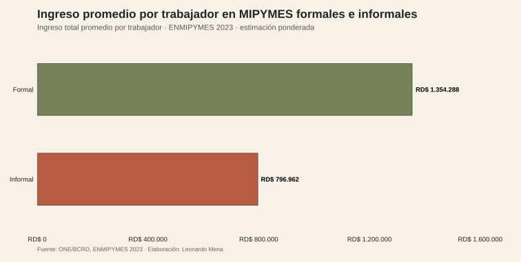
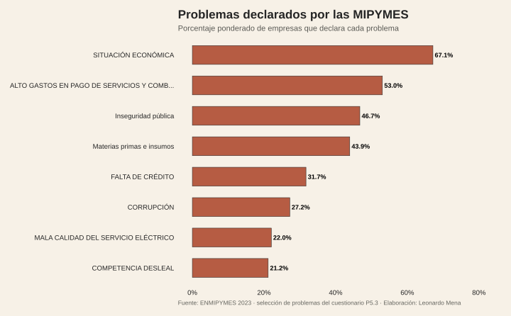
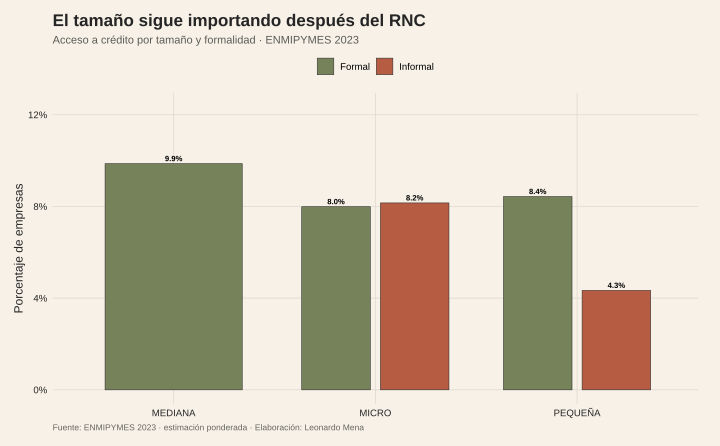
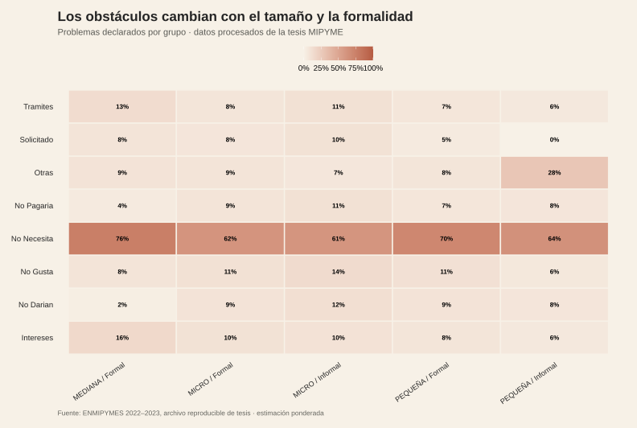

<script>document.body.classList.add('editorial-post');</script>

```{=html}
<figure class="article-figure"><figcaption>Ingreso total promedio por trabajador y formalidad.</figcaption></figure>
<figure class="article-figure"><figcaption>Problemas declarados por las MIPYMES.</figcaption></figure>
<figure class="article-figure"><figcaption>Acceso a crédito por tamaño y formalidad.</figcaption></figure>
<figure class="article-figure"><figcaption>Problemas declarados por tamaño y formalidad.</figcaption></figure>
```

<figure class="article-figure"><figcaption>Formalidad MIPYME por provincia.</figcaption></figure>

## Fuentes y materiales reproducibles

- [Constructor de figuras](../../../research/build-five-post-graphics.R)
- [Datos procesados](../../../research/camus-mipyme/data/procesados/)
- [Datos de la tesis incorporados al repositorio](../../../research/camus-mipyme/data/raw/tesis/)
- [Manifiesto SHA-256 de las bases de tesis](../../../research/camus-mipyme/data/raw/tesis/tesis-mipyme-manifest.csv)
- [Importador reproducible de las bases de tesis](../../../tools/import-thesis-mipyme.ps1)
- [Mapa de figuras](../../../research/camus-mipyme/chart-map.csv)
- [Base MIPYME del blog](../../../posts/republica-en-un-grafico/2026-02-14-mipymes-rd/Encuesta-Nacional-a-las-MIPYMES-2023-Base-de-datos.xlsx)
