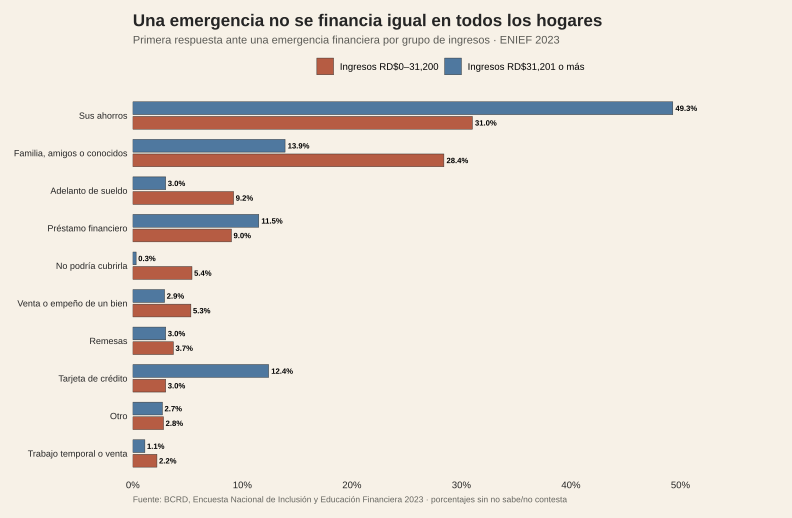

<!-- Borrador visual. La narrativa se añadirá después. -->

<figure class="article-figure"><figcaption>Primera respuesta ante una emergencia financiera por grupo de ingreso.</figcaption></figure>

## Fuentes y materiales

- [Constructor de figuras](../../../research/build-pending-post-graphics.R)
- [Datos procesados](../../../research/epicteto-fondo-emergencia/data/procesados/)
- [Mapa de figuras](../../../research/epicteto-fondo-emergencia/chart-map.csv)

