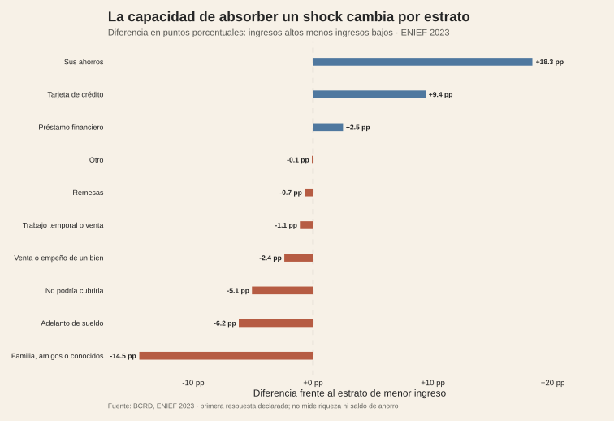

<!-- Borrador visual. La narrativa se añadirá después. -->

<figure class="article-figure"><figcaption>Primera respuesta ante una emergencia financiera por grupo de ingreso.</figcaption></figure>
<figure class="article-figure"><figcaption>La diferencia entre estratos se concentra en el tipo de respuesta disponible.</figcaption></figure>

## Metodología

La fuente es la ENIEF 2023 del BCRD. La unidad es la respuesta declarada por persona ante una emergencia financiera, comparando los estratos de ingresos RD$0–31,200 y RD$31,201 o más. El segundo gráfico resta, para cada respuesta, el porcentaje del estrato bajo al porcentaje del estrato alto y lo expresa en puntos porcentuales.

Son porcentajes descriptivos de primera respuesta, no una medida del saldo de ahorro ni una prueba causal de que el ingreso determine la conducta. La encuesta puede mostrar restricciones y mecanismos de afrontamiento, pero no permite inferir por sí sola riqueza, liquidez permanente o resiliencia de largo plazo.

## Fuentes y materiales

- [Constructor de figuras](../../../research/build-requested-methodology-visuals.R)
- [Datos procesados](../../../research/epicteto-fondo-emergencia/data/procesados/)
- [Mapa de figuras](../../../research/epicteto-fondo-emergencia/chart-map.csv)
