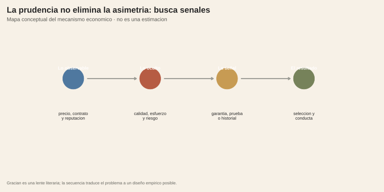

<!-- Borrador visual. La narrativa se añadirá después. -->

<figure class="article-figure"><figcaption>Información observada y oculta en una relación de intercambio.</figcaption></figure>
<figure class="article-figure"><figcaption>Una señal puede reducir la incertidumbre, pero también puede ser costosa o imperfecta.</figcaption></figure>

## Metodología

Este paquete es conceptual: no presenta una estimación ni atribuye a Gracián la autoría de la teoría económica moderna. La matriz separa información observable y oculta antes y después del intercambio; el flujo convierte esa distinción en un mecanismo: lo oculto puede afectar la selección o la conducta, mientras una señal —garantía, historial o reputación— puede cambiar la información disponible.

La extensión empírica natural sería medir si una señal observable cambia la selección o el comportamiento en crédito, seguros o empleo, controlando por composición y acceso. Esa prueba queda pendiente y no se debe leer en estas figuras.

## Fuentes y materiales

- [Constructor de figuras](../../../research/build-requested-methodology-visuals.R)
- [Mapa de figuras](../../../research/gracian-economia-informacion/chart-map.csv)
