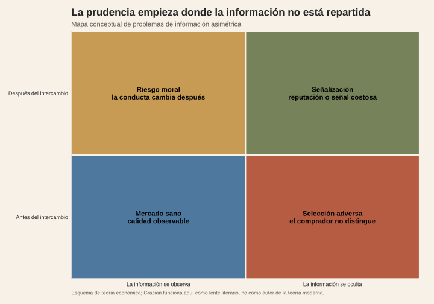

<!-- Borrador visual. La narrativa se añadirá después. -->

<figure class="article-figure"><figcaption>Información observada y oculta en una relación de intercambio.</figcaption></figure>

## Fuentes y materiales

- [Constructor de figuras](../../../research/build-pending-post-graphics.R)
- [Mapa de figuras](../../../research/gracian-economia-informacion/chart-map.csv)

