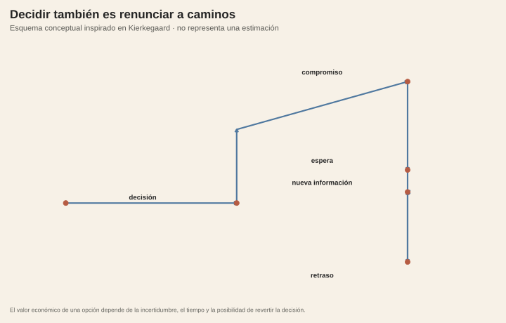

<!-- Borrador visual. La narrativa se añadirá después. -->

<figure class="article-figure"><figcaption>Decisión, compromiso y caminos que dejan de estar disponibles.</figcaption></figure>

## Fuentes y materiales

- [Constructor de figuras](../../../research/build-pending-post-graphics.R)
- [Mapa de figuras](../../../research/kierkegaard-decision/chart-map.csv)

