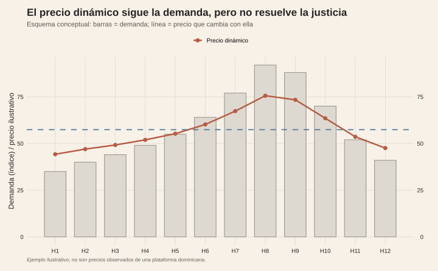

<!-- Borrador visual. La narrativa se añadirá después. -->

<figure class="article-figure"><figcaption>Demanda y precio dinámico en un esquema ilustrativo.</figcaption></figure>
<figure class="article-figure"><figcaption>Eficiencia y justicia percibida como dimensiones distintas.</figcaption></figure>

## Fuentes y materiales

- [Constructor de figuras](../../../research/build-pending-post-graphics.R)
- [Mapa de figuras](../../../research/precio-justo-pricing-dinamico/chart-map.csv)

