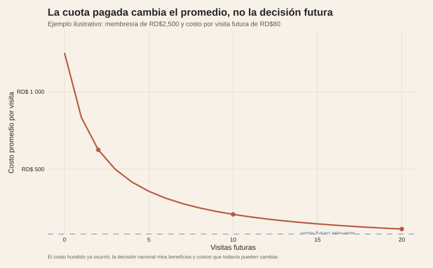
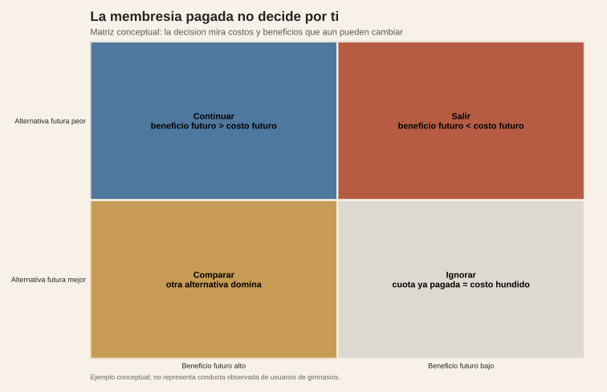

<!-- Borrador visual. La narrativa se añadirá después. -->

<figure class="article-figure"><figcaption>Costo hundido frente a costos y beneficios que todavía pueden cambiar.</figcaption></figure>
<figure class="article-figure"><figcaption>La decisión correcta compara beneficios y costos futuros, no la cuota ya pagada.</figcaption></figure>

## Metodología

El primer gráfico es un ejemplo ilustrativo: muestra que la cuota ya pagada cambia el promedio contable por visita, pero no es recuperable. La decisión debe comparar beneficios y costos futuros con las alternativas disponibles. El segundo gráfico traduce esa regla a una matriz conceptual de cuatro escenarios.

No son precios observados ni una estimación de comportamiento de usuarios de gimnasios. Para llevarlo a datos haría falta una encuesta o experimento con viñetas que varíe la cuota hundida, el costo futuro y la calidad de la alternativa.

## Fuentes y materiales

- [Constructor de figuras](../../../research/build-requested-methodology-visuals.R)
- [Mapa de figuras](../../../research/sunk-cost-gimnasio/chart-map.csv)
