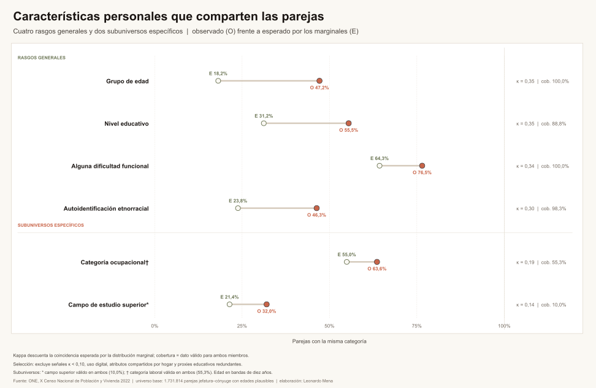
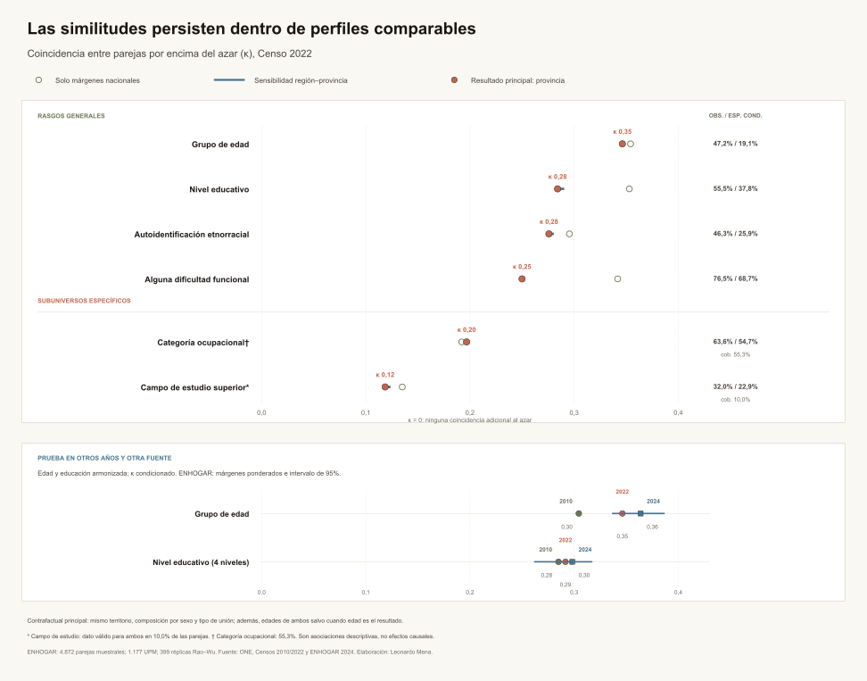
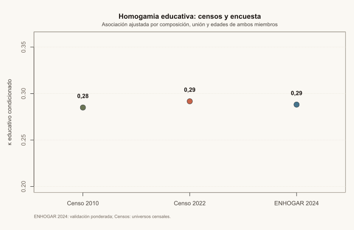

<style>
.research-question {
  border-left: 4px solid #b85c38;
  background: #f7efe5;
  padding: 1rem 1.25rem;
  margin: 1.25rem 0 2rem;
}

.research-note {
  color: #5f6257;
  font-size: .92rem;
  border-top: 1px solid #d8cdbb;
  padding-top: .75rem;
  margin-top: 1rem;
}
</style>

<script>document.body.classList.add('editorial-post');</script>

<div class="research-question">
<strong>Pregunta de trabajo:</strong> ¿las parejas se parecen en educación porque se eligen entre personas similares, porque convergen durante la convivencia o porque comparten el mismo entorno social?
</div>

Este draft usa parejas convivientes identificables en el Censo 2022: una persona declarada como jefatura y otra como cónyuge o compañera/o, ambas con edades plausibles. La lectura económica será sobre selección, emparejamiento y acumulación de ventajas, no sobre efectos causales individuales.

## 1. No basta con contar coincidencias

No usaré como resultado principal el porcentaje de parejas que comparte situación laboral u otra categoría común. Ese porcentaje puede ser alto simplemente porque la categoría es frecuente en la población. Por ejemplo, que dos personas estén ocupadas no demuestra homogamia laboral: puede reflejar que trabajar es común.

La comparación correcta parte de una expectativa: ¿cuánta coincidencia observaríamos si las características de jefaturas y cónyuges se combinaran respetando sus distribuciones, pero sin asociación adicional?

## 2. ¿Más coincidencia que la que produciría el azar?

La similitud simple mezcla dos cosas: la elección de pareja y la distribución de características en la población. Para separar parcialmente ambas, el siguiente gráfico compara la coincidencia observada con la coincidencia esperada si los márgenes de jefaturas y cónyuges se combinaran de manera independiente.

```{=html}
<figure class="article-figure">
  
  <figcaption>Homogamia ajustada: coincidencia observada frente a esperada por las distribuciones marginales. κ mide asociación, no causalidad.</figcaption>
</figure>
```

<div class="research-note">
La figura principal selecciona seis rasgos y distingue rasgos generales de subuniversos específicos. Campo de estudio y categoría ocupacional tienen coberturas reducidas; la advertencia forma parte del resultado, no es un detalle secundario.
</div>

## 3. La prueba difícil: comparar perfiles similares

La asociación puede estar influida por territorio, composición por sexo, tipo de unión y edades. La especificación condicionada conserva esos márgenes dentro de estratos comparables y muestra la sensibilidad región–provincia. También incorpora una réplica armonizada de los Censos 2010 y 2022 y una validación externa con ENHOGAR 2024.

```{=html}
<figure class="article-figure">
  
  <figcaption>Homogamia condicionada y validación temporal/externa. Las asociaciones permanecen positivas, pero su magnitud depende del rasgo y del universo observado.</figcaption>
</figure>
```

<div class="research-note">
Método, cobertura, fórmulas, estratos y límites: <a href="../../../research/mercado-laboral-dominicano/metodologia-homogamia-condicionada.md">nota metodológica de homogamia condicionada</a>.
</div>

## 4. Validación externa: ENHOGAR 2022

Para comprobar que el patrón no depende exclusivamente del universo censal, se reconstruyen parejas en ENHOGAR 2024 usando el identificador de hogar de la encuesta y el factor de expansión oficial. La estimación no elimina a las parejas donde una persona no trabaja: el ajuste educativo se realiza sobre edad, composición sexual, tipo de unión y región.

```{=html}
<figure class="article-figure">
  
  <figcaption>Validación ponderada de la asociación educativa. El punto de ENHOGAR 2024 es muestral; los puntos censales describen universos completos.</figcaption>
</figure>
```

<div class="research-note">
El modelo logit descriptivo estima la probabilidad de que ambos miembros compartan el nivel educativo, ajustando por región, composición sexual, tipo de unión y bandas de edad de ambos. No se presentan p-valores como si los Censos fueran encuestas muestrales y el resultado no se interpreta como causal. La cifra de ENHOGAR 2024 puede diferir de la figura anterior porque allí se usa otra estratificación; la comparación válida es la persistencia de una asociación positiva, no la igualdad decimal entre estimandos.
</div>

Las microdata y diccionarios utilizados provienen de la [ONE](https://www.one.gob.do/datos-y-estadisticas/): [personas ENHOGAR 2024](https://www.one.gob.do/catalogo-datos/ENHOGAR/ENHOGAR_2024_BD_PUB/BD_ENH24_PERSONAS.csv) y [hogares ENHOGAR 2024](https://www.one.gob.do/catalogo-datos/ENHOGAR/ENHOGAR_2024_BD_PUB/BD_ENH24_HOGARES.csv).

## Marco económico para desarrollar

- Mercado de emparejamiento y selección de pareja.
- Homogamia educativa y acumulación de capital humano dentro del hogar.
- Complementariedad o similitud de características productivas.
- Diferencia entre asociación descriptiva, selección inicial y convergencia durante la convivencia.
- Posibles implicaciones para movilidad social intergeneracional y desigualdad de oportunidades.
- Diferencia entre similitud bruta, asociación ajustada y probabilidad predicha por un modelo logit.

## Límites que deben permanecer visibles

- El análisis describe parejas convivientes identificables, no todas las relaciones.
- El Censo es transversal: no permite separar selección de convergencia conyugal.
- Jefatura y cónyuge son roles censales asimétricos.
- Campo de estudio y categoría ocupacional son subuniversos con cobertura limitada.
- La homogamia estimada no es un efecto causal de la educación sobre la elección de pareja.
- No se debe controlar automáticamente por empleo: puede ser una consecuencia de la educación o una fuente de selección. Por eso queda fuera del ajuste principal.

## Material reproducible

- [Datos procesados de similitud de parejas](../../../research/mercado-laboral-dominicano/data/procesados/10_similitud_parejas.csv)
- [Datos procesados de homogamia ajustada](../../../research/mercado-laboral-dominicano/data/procesados/11_homogamia_ajustada.csv)
- [Datos procesados de homogamia condicionada](../../../research/mercado-laboral-dominicano/data/procesados/12_homogamia_condicionada.csv)
- [Validación Censo 2010 / Censo 2022 / ENHOGAR 2024](../../../research/mercado-laboral-dominicano/data/procesados/12_homogamia_validacion.csv)
- [Validación ponderada ENHOGAR 2022 y modelo logit](../../../research/mercado-laboral-dominicano/data/procesados/13_homogamia_enhogar_2022.csv)
- [Validación ponderada ENHOGAR 2024 y modelo logit](../../../research/mercado-laboral-dominicano/data/procesados/14_homogamia_enhogar_2024.csv)
- [Controles de calidad de homogamia](../../../research/mercado-laboral-dominicano/qa-homogamia-condicionada.csv)
