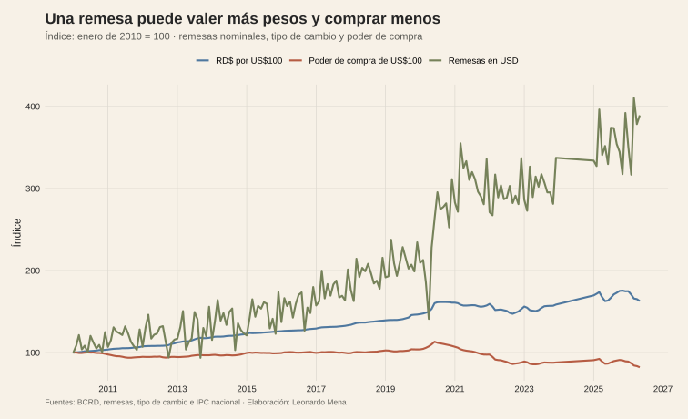
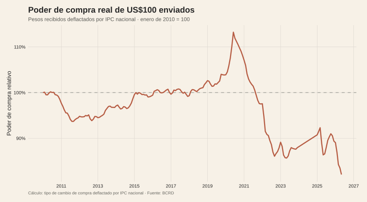
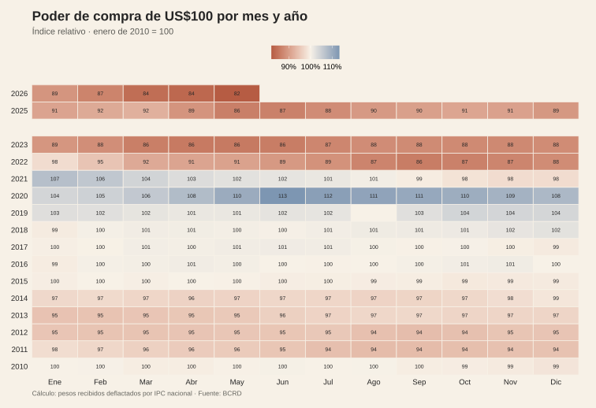

<script>document.body.classList.add('editorial-post');</script>

```{=html}
<figure class="article-figure"><figcaption>Remesas, tipo de cambio y poder de compra real.</figcaption></figure>
<figure class="article-figure"><figcaption>Poder de compra real de US$100 recibidos.</figcaption></figure>
<figure class="article-figure"><figcaption>Poder de compra por mes y año.</figcaption></figure>
```

## Fuentes y materiales reproducibles

- [Constructor de figuras](../../../research/build-five-post-graphics.R)
- [Datos procesados](../../../research/peso-fuerte-remesas/data/procesados/)
- [Mapa de figuras](../../../research/peso-fuerte-remesas/chart-map.csv)
- [Estadísticas tradicionales del BCRD](https://www.bancentral.gov.do/a/d/3866-estadisticas-tradicionales)
- [Mercado cambiario del BCRD](https://bancentral.gov.do/a/CustomView/2538-mercado-cambiario)

