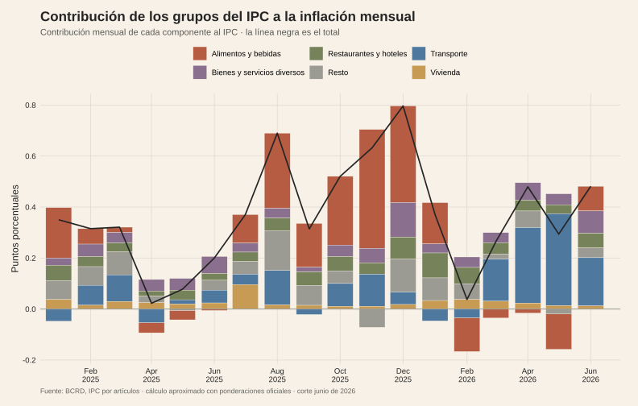
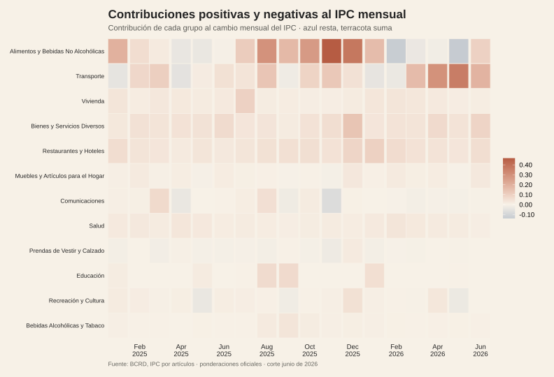
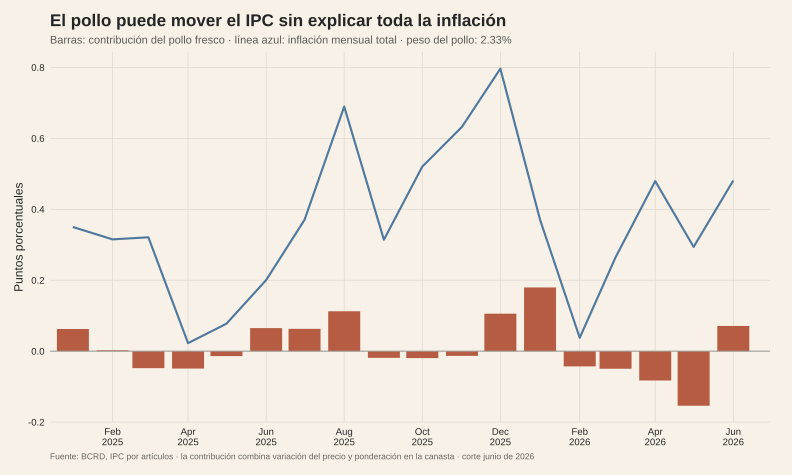
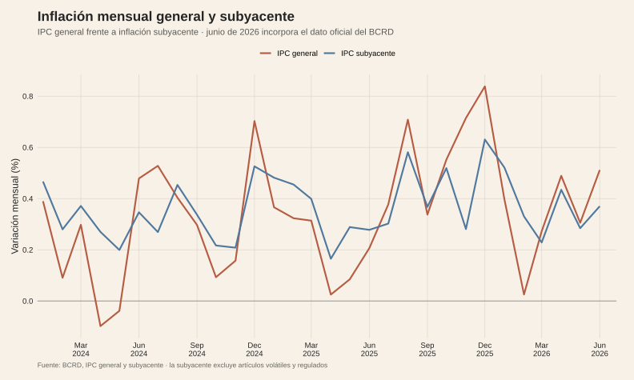
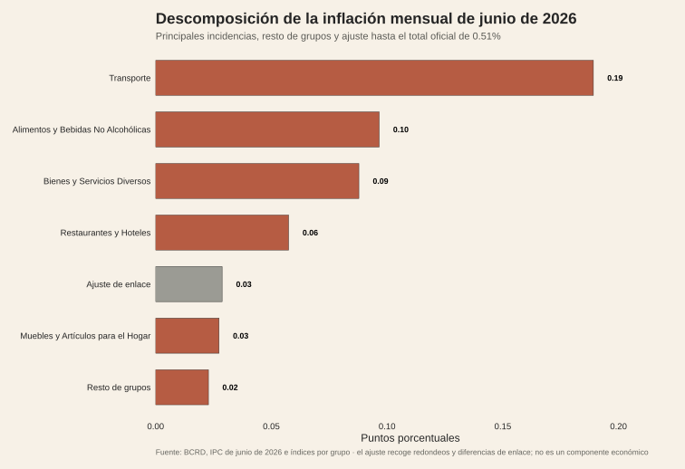
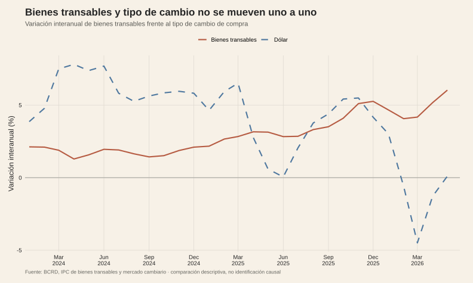

<script>document.body.classList.add('editorial-post');</script>

```{=html}
<figure class="article-figure"><figcaption>La inflación mensual es la suma ponderada de muchos componentes.</figcaption></figure>
<figure class="article-figure"><figcaption>Los motores de la inflación cambian de un mes a otro.</figcaption></figure>
<figure class="article-figure"><figcaption>El pollo muestra la diferencia entre variar mucho y tener una gran incidencia.</figcaption></figure>
<figure class="article-figure"><figcaption>La inflación general y la subyacente no siempre se mueven juntas.</figcaption></figure>
<figure class="article-figure"><figcaption>El dato oficial de junio se puede leer como una suma de incidencias.</figcaption></figure>
<figure class="article-figure"><figcaption>El dólar transmite presión a los bienes transables, pero no explica todo el IPC.</figcaption></figure>
```

## Fuentes y materiales reproducibles

- [Constructor de figuras](../../../research/build-inflation-graphics.R)
- [Datos procesados](../../../research/pollo-inflacion/data/procesados/)
- [Mapa de figuras](../../../research/pollo-inflacion/chart-map.csv)
- [Informe IPC de junio de 2026 del BCRD](https://www.bancentral.gov.do/a/d/6611)
- [Consulta del IPC del BCRD](https://www.bancentral.gov.do/a/ipc-consulta)
