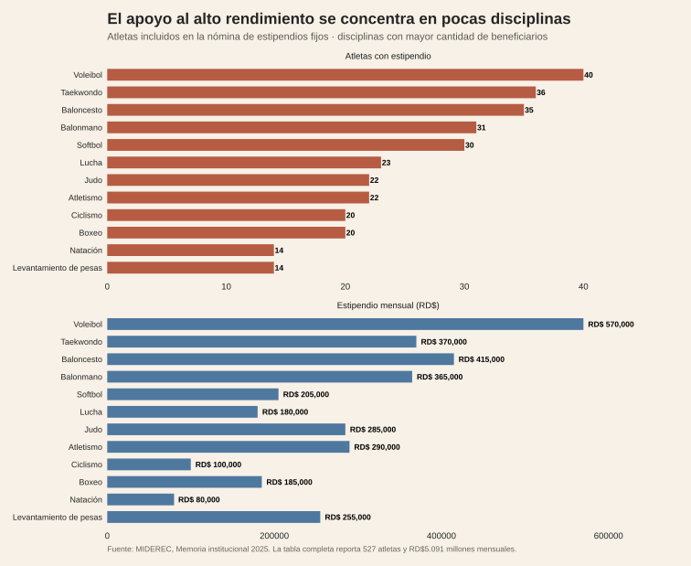
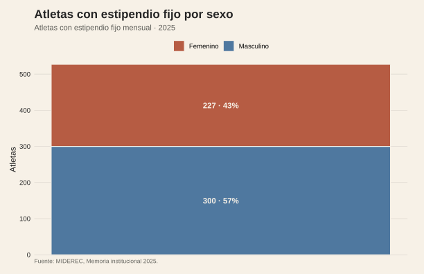
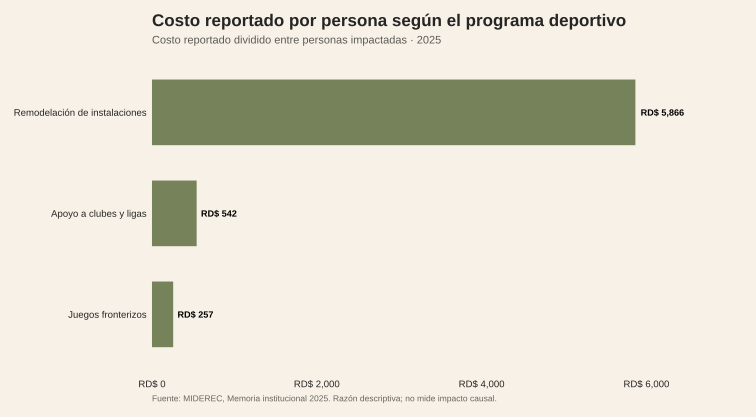

<!-- Borrador visual. La narrativa se añadirá después. -->

<figure class="article-figure"><figcaption>Atletas y estipendios por disciplina.</figcaption></figure>
<figure class="article-figure"><figcaption>Distribución de atletas con estipendio fijo por sexo.</figcaption></figure>
<figure class="article-figure"><figcaption>Costo reportado por persona según programa.</figcaption></figure>

## Fuentes y materiales

- [Constructor de figuras](../../../research/build-data-rich-post-graphics.R)
- [Datos procesados](../../../research/atletas-spillover/data/procesados/)
- [Mapa de figuras](../../../research/atletas-spillover/chart-map.csv)

