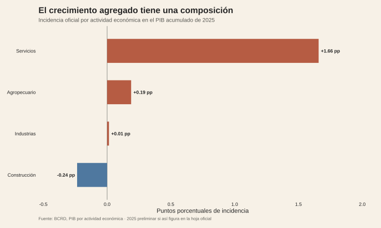
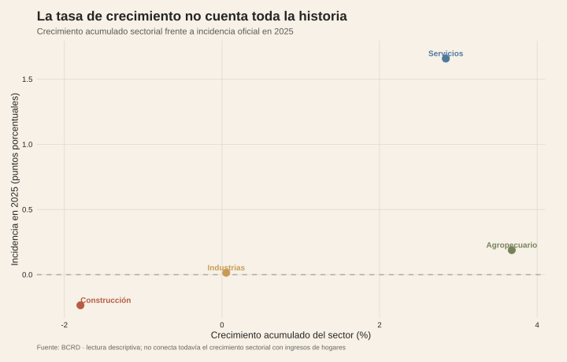
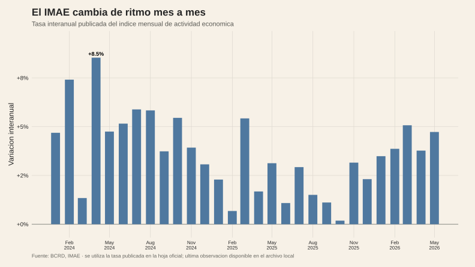

<!-- Borrador visual. La narrativa se añadirá después de cerrar la descomposición sectorial. -->

<!--
Visuales pendientes:
1. Descomposición del crecimiento del PIB por actividad económica.
2. Evolución del IMAE y contribución de los sectores al crecimiento agregado.
3. Comparación entre el peso de cada sector en el crecimiento y su vínculo con empleo,
   remuneraciones o ingresos de los hogares, cuando la fuente permita una comparación válida.
-->

<figure class="article-figure"><figcaption>El crecimiento agregado tiene una composición sectorial.</figcaption></figure>
<figure class="article-figure"><figcaption>La tasa de crecimiento sectorial no cuenta toda la historia.</figcaption></figure>
<figure class="article-figure"><figcaption>El ritmo de actividad también cambia mes a mes.</figcaption></figure>

## Metodología

La descomposición usa la hoja `PIBK_Trim_Acum` del BCRD: el índice de volumen de 2024, el crecimiento acumulado de 2025 y la incidencia oficial de cada actividad. Se conservan cuatro actividades de primer nivel —Agropecuario, Industrias, Construcción y Servicios— para evitar mezclar subsectores con el total. La segunda figura compara crecimiento e incidencia sin llamar “peso” a un índice de volumen; la tercera usa la tasa interanual publicada en la serie mensual del IMAE.

El corte es el disponible en la hoja local; 2025 aparece como preliminar cuando así lo marca el BCRD. Estas figuras explican la composición del PIB y del IMAE, no la distribución del crecimiento entre hogares. Para estudiar esa transmisión habría que enlazar otra fuente —por ejemplo ENCFT— con una unidad, periodo y definición de ingreso compatibles; no se infiere ese vínculo desde el PIB agregado.

## Fuentes y materiales

- [IMAE del BCRD](../../../atlas/data/raw/bcrd-sector-real/imae_2018.xlsx)
- [PIB por actividad económica del BCRD](../../../atlas/data/raw/bcrd-sector-real/pib_origen_2018.xlsx)
- [Serie general del PIB del BCRD](../../../atlas/data/raw/bcrd-sector-real/pib_2018.xlsx)
- [Constructor de figuras y datos procesados](../../../research/build-requested-methodology-visuals.R)
- [Mapa de figuras](../../../research/crecimiento-6-4-hogares/chart-map.csv)
