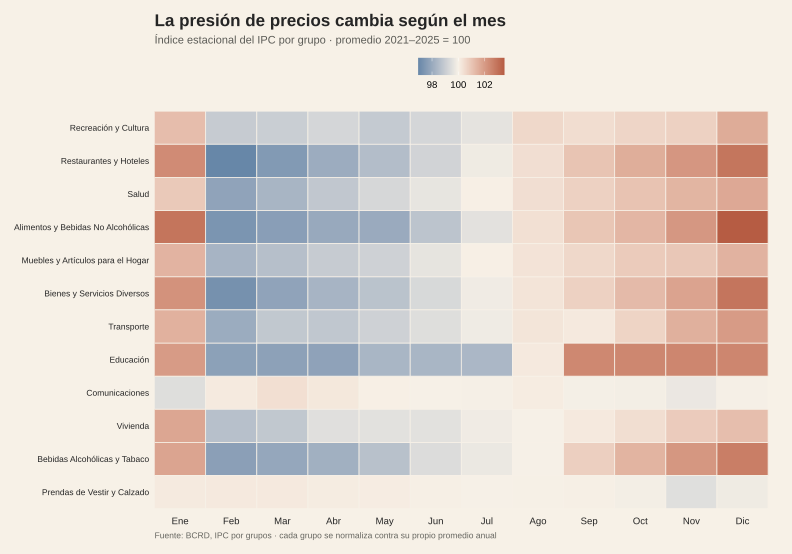
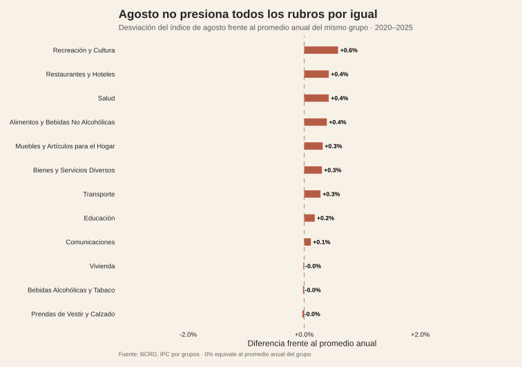
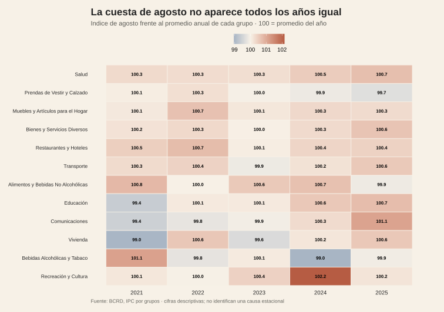

<!-- Borrador visual. La narrativa se añadirá después. -->

<figure class="article-figure"><figcaption>Índice estacional del IPC por grupo.</figcaption></figure>
<figure class="article-figure"><figcaption>Desviación del índice de agosto frente al promedio anual del grupo.</figcaption></figure>
<figure class="article-figure"><figcaption>La intensidad de agosto cambia por grupo y también por año.</figcaption></figure>

## Metodología

La unidad de análisis es el índice mensual del IPC por grupo. Para no confundir niveles de precios con estacionalidad, cada grupo se normaliza contra su propio promedio anual: 100 representa el promedio del año y un valor mayor indica que agosto estuvo relativamente por encima de ese promedio. El primer mapa resume 2020–2025; el tercero conserva cada año por separado para mostrar la estabilidad —o inestabilidad— del patrón.

Esto es una descripción estacional, no una estimación causal. No se aplican ponderaciones adicionales ni se afirma que agosto produzca el aumento: el cálculo solo identifica cuándo y en qué rubros el índice se aparta de su referencia anual.

## Fuentes y materiales

- [Constructor de figuras](../../../research/build-requested-methodology-visuals.R)
- [Datos procesados](../../../research/cuesta-agosto/data/procesados/)
- [Mapa de figuras](../../../research/cuesta-agosto/chart-map.csv)
