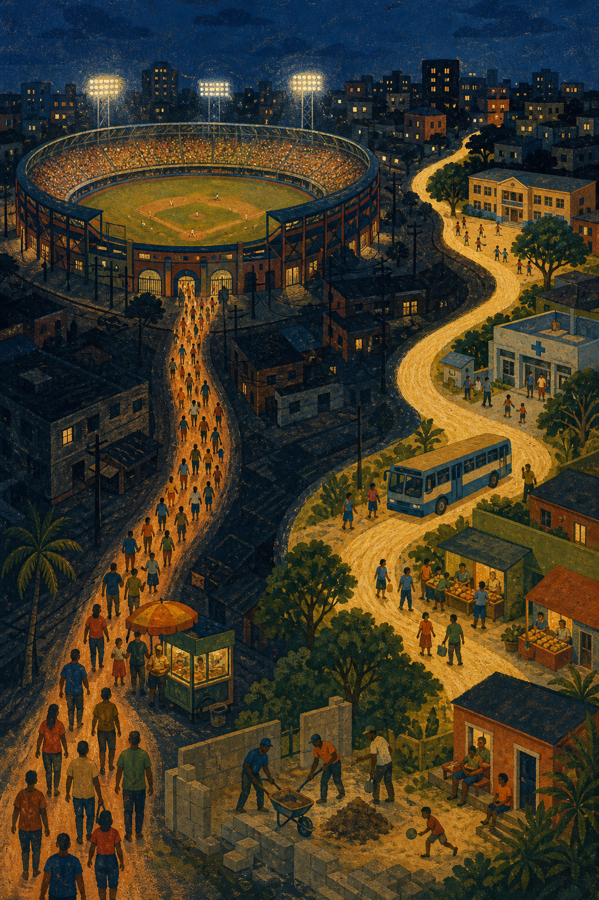
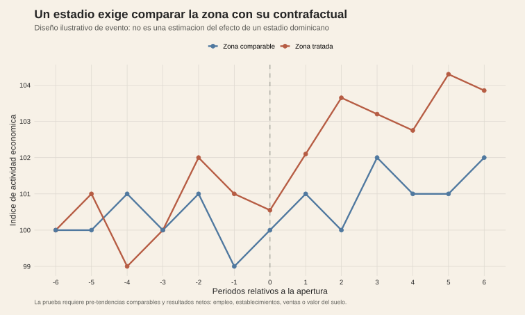

<!-- Borrador visual. La evidencia empírica y la narrativa se añadirán después. -->

<figure class="article-figure"><figcaption>La actividad visible alrededor de un estadio no equivale por sí sola a desarrollo económico neto.</figcaption></figure>
<figure class="article-figure"><figcaption>La pregunta empírica es qué ocurre en la zona tratada frente a un contrafactual comparable.</figcaption></figure>

## Metodología

La ilustración de evento es un esquema metodológico, no un resultado observado en República Dominicana. La unidad propuesta es zona geográfica por periodo: una zona tratada alrededor del estadio y una zona comparable que reproduzca sus tendencias previas. El diseño requiere comprobar pre-tendencias y estimar un evento o una diferencia en diferencias alrededor de la apertura.

Los resultados deben medir actividad neta —empleo, establecimientos, ventas o valor del suelo— y considerar sustitución, desplazamiento, filtraciones y costo público. Ver más personas en un estadio o más comercios en una noche no identifica por sí solo un spillover permanente.

## Fuentes y materiales

- [Mapa de figuras](../../../research/efecto-baade/chart-map.csv)
- [Ilustración editorial](../../../research/efecto-baade/assets/ilustracion-spillover-estadio.png)
- [Constructor de figuras y diseño ilustrativo](../../../research/build-requested-methodology-visuals.R)
- [Baade y Dye, The Impact of Stadiums and Professional Sports on Metropolitan Area Development](https://onlinelibrary.wiley.com/doi/pdf/10.1111/j.1468-2257.1990.tb00513.x)
