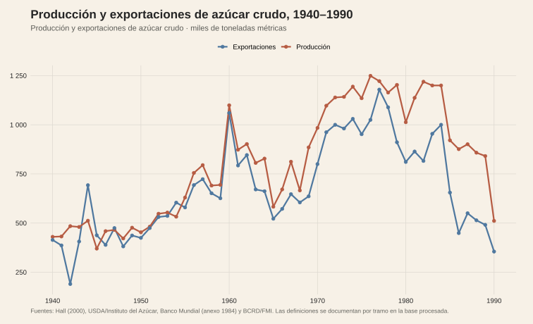
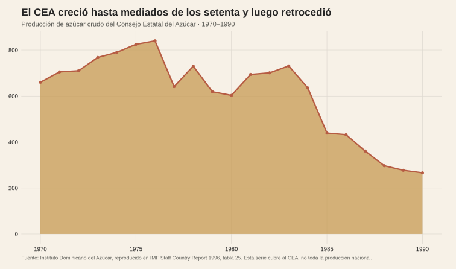
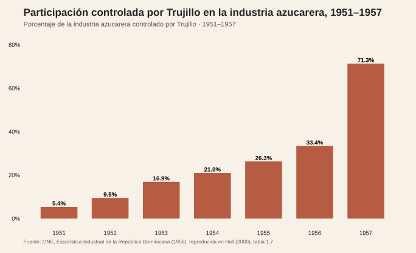

<!-- Borrador visual. La narrativa se añadirá después. -->

<figure class="article-figure"><figcaption>Producción y exportaciones de azúcar crudo, 1940–1990.</figcaption></figure>
<figure class="article-figure"><figcaption>Producción del CEA, 1970–1990.</figcaption></figure>
<figure class="article-figure"><figcaption>Control de Trujillo en la industria azucarera.</figcaption></figure>

## Fuentes y materiales

- [Constructor de figuras](../../../research/build-historical-sugar-graphics.R)
- [Datos procesados](../../../research/ingenios-azucar/data/procesados/)
- [Fuentes históricas descargadas](../../../research/ingenios-azucar/data/raw/)
- [Mapa de figuras](../../../research/ingenios-azucar/chart-map.csv)

