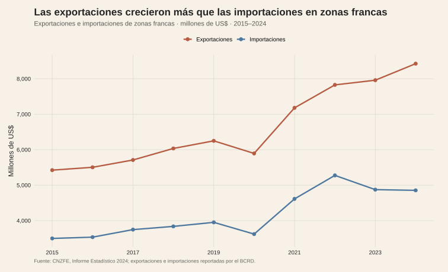
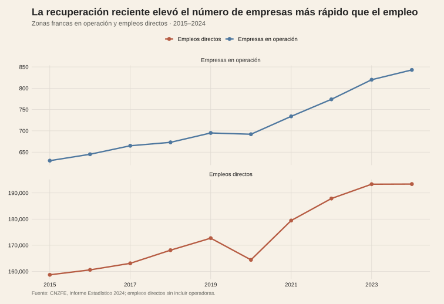
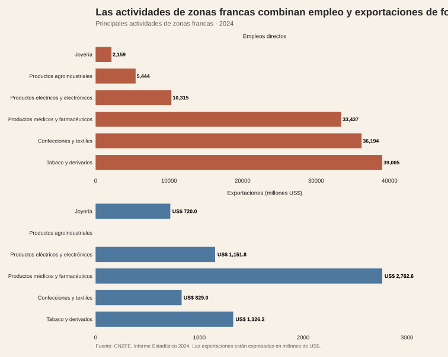
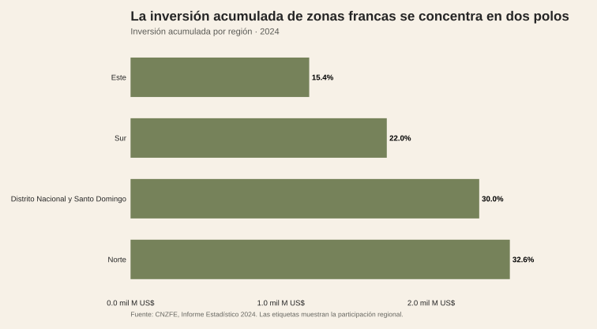

<!-- Borrador visual. La narrativa se añadirá después. -->

<figure class="article-figure"><figcaption>Exportaciones e importaciones de zonas francas.</figcaption></figure>
<figure class="article-figure"><figcaption>Empresas en operación y empleo directo.</figcaption></figure>
<figure class="article-figure"><figcaption>Empleo y exportaciones por actividad.</figcaption></figure>
<figure class="article-figure"><figcaption>Inversión acumulada por región.</figcaption></figure>

## Fuentes y materiales

- [Constructor de figuras](../../../research/build-data-rich-post-graphics.R)
- [Datos procesados](../../../research/nearshoring-limites/data/procesados/)
- [Mapa de figuras](../../../research/nearshoring-limites/chart-map.csv)

