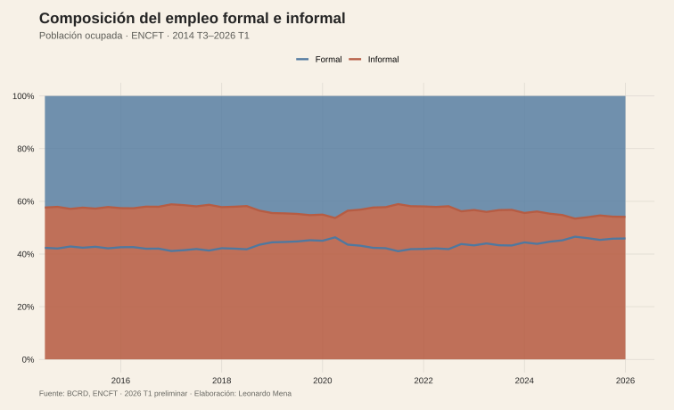
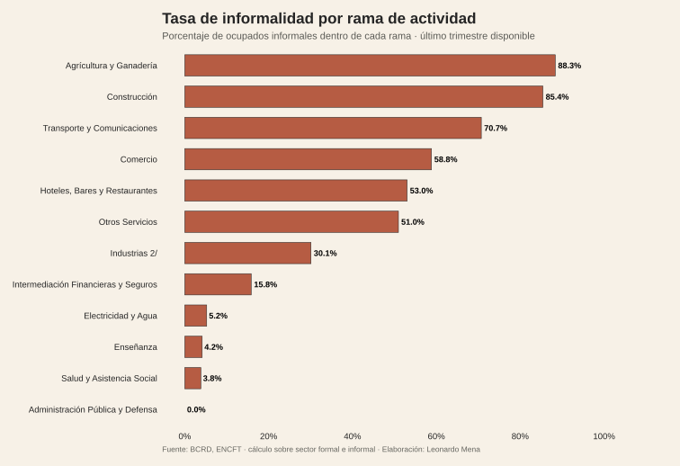
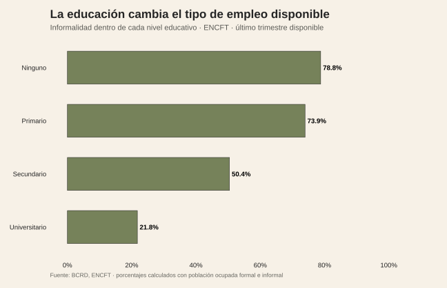
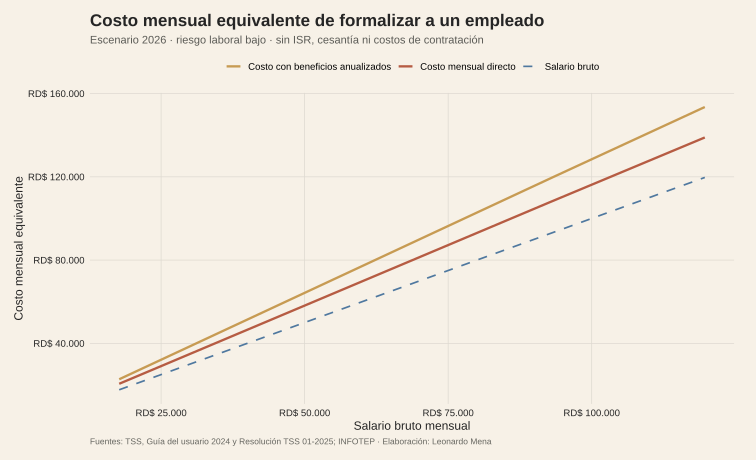
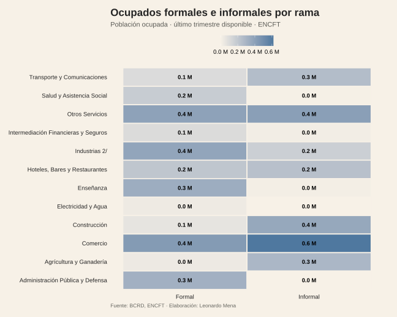
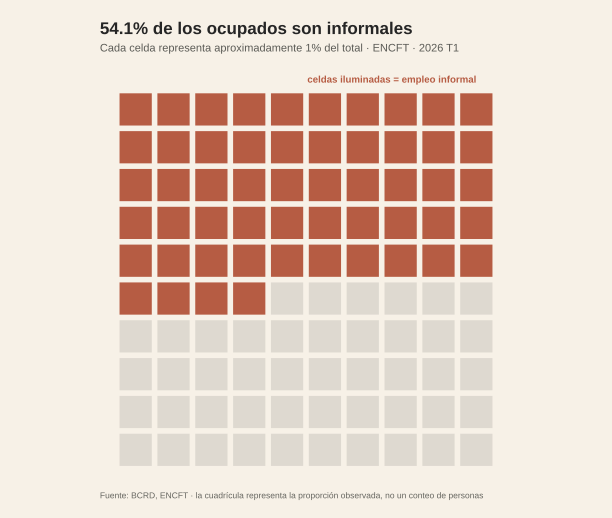
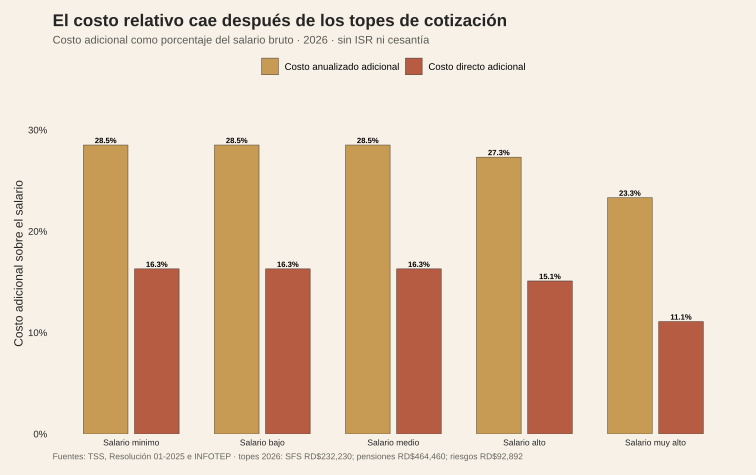

<script>document.body.classList.add('editorial-post');</script>

```{=html}
<figure class="article-figure"><figcaption>Formalidad e informalidad en la población ocupada, ENCFT.</figcaption></figure>
<figure class="article-figure"><figcaption>Informalidad dentro de cada rama de actividad.</figcaption></figure>
<figure class="article-figure"><figcaption>Informalidad por nivel educativo.</figcaption></figure>
<figure class="article-figure"><figcaption>Escenario legal de formalización: TSS, INFOTEP, salario 13 y vacaciones anualizadas.</figcaption></figure>
<figure class="article-figure"><figcaption>Matriz de ocupados formales e informales por rama.</figcaption></figure>
```

<figure class="article-figure"><figcaption>Cuadricula proporcional: cada celda representa aproximadamente 1% del empleo ocupado.</figcaption></figure>
<figure class="article-figure"><figcaption>Presion laboral amplia por macroregion. SU4 no es una tasa de informalidad.</figcaption></figure>
<figure class="article-figure"><figcaption>Costo adicional sobre el salario: los topes de cotización rompen la proporcionalidad en salarios altos.</figcaption></figure>

## Fuentes y materiales reproducibles

- [Constructor de figuras](../../../research/build-five-post-graphics.R)
- [Datos procesados](../../../research/trampa-empleo-informal/data/procesados/)
- [Mapa de figuras](../../../research/trampa-empleo-informal/chart-map.csv)
- [Topes TSS vigentes desde febrero de 2026](https://tss.gob.do/tss-informa-nuevos-topes-de-cotizacion-del-regimen-contributivo/)
- [Estadísticas laborales del BCRD](https://www.bancentral.gov.do/a/d/3866-estadisticas-tradicionales)
- [Guía TSS 2024](https://www.tss.gob.do/assets/guiausuario24b.pdf)
- [Resolución TSS 01-2025](https://www.tss.gob.do/assets/reso01-2025.pdf)
