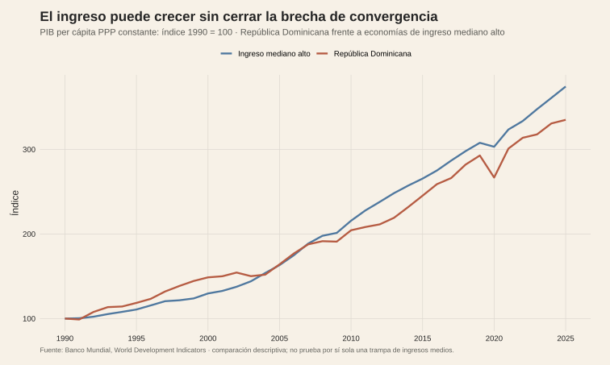
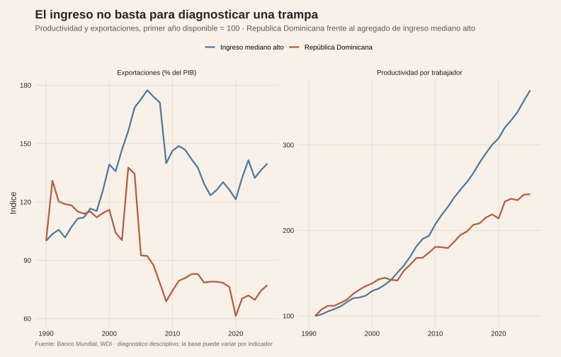

<!-- Borrador visual. La narrativa se añadirá después. -->

<figure class="article-figure"><figcaption>Trayectoria comparada del ingreso per cápita.</figcaption></figure>
<figure class="article-figure"><figcaption>El ingreso se diagnostica junto con productividad y apertura, no por separado.</figcaption></figure>

## Metodología

El primer gráfico usa series del Banco Mundial en PPP constante y las expresa como índices relativos a su primer año disponible. El segundo repite esa comparación para productividad por trabajador y exportaciones como porcentaje del PIB, manteniendo separadas la República Dominicana y el agregado de economías de ingreso mediano alto.

La lectura es un diagnóstico descriptivo de convergencia. Una trayectoria que no cierre la brecha no demuestra por sí sola una trampa de ingresos medios: la versión econométrica tendría que estudiar productividad, composición sectorial, instituciones y quiebres estructurales, con controles comparables.

## Fuentes y materiales

- [Constructor de figuras](../../../research/build-requested-methodology-visuals.R)
- [Datos procesados](../../../research/trampa-ingresos-medios/data/procesados/)
- [Mapa de figuras](../../../research/trampa-ingresos-medios/chart-map.csv)
