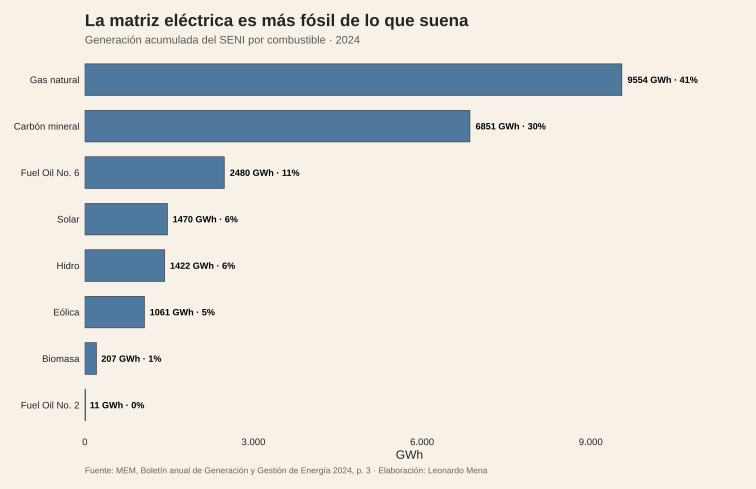
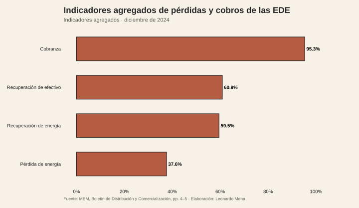
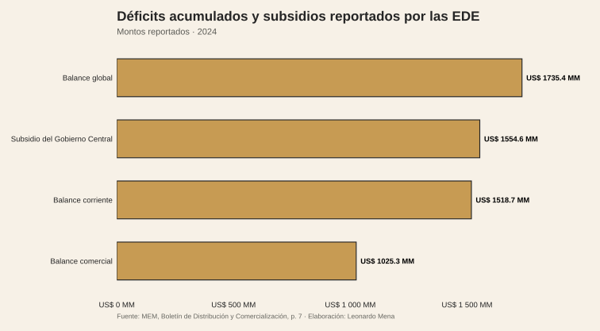
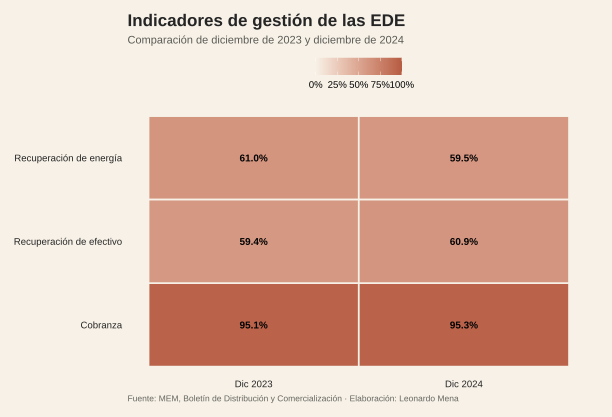

<script>document.body.classList.add('editorial-post');</script>

```{=html}
<figure class="article-figure"><figcaption>Matriz de generación del SENI por combustible.</figcaption></figure>
<figure class="article-figure"><figcaption>Pérdidas, recuperación y cobranza.</figcaption></figure>
<figure class="article-figure"><figcaption>Déficits acumulados y subsidio.</figcaption></figure>
<figure class="article-figure"><figcaption>Indicadores de gestión: diciembre de 2023 frente a diciembre de 2024.</figcaption></figure>
```

<figure class="article-figure"><figcaption>Perdidas totales reportadas por provincia, agregadas por GWh cuando se superponen EDE; el informe no separa componentes tecnicos y no tecnicos.</figcaption></figure>

## Fuentes y materiales reproducibles

- [Constructor de figuras](../../../research/build-five-post-graphics.R)
- [Datos procesados](../../../research/sector-electrico-dominicano/data/procesados/)
- [Informe MEM de Gestión Comercial EDE, abril de 2026](https://mem.gob.do/wp-content/uploads/2026/07/Informe_Gestion_Comercial_EDE_abril_2026.pdf)
- [Mapa de figuras](../../../research/sector-electrico-dominicano/chart-map.csv)
- [Manifiesto local de boletines e informes MEM](../../../research/sector-electrico-dominicano/data/raw/mem/mem-electricity-manifest.csv)
- [Descargador reproducible de series MEM](../../../tools/download-mem-electricity-series.ps1)
- [Catálogo MEM de boletines de generación](https://mem.gob.do/category/sector-electrico/boletin-de-generacion-y-gestion-de-energia/)
- [Catálogo MEM de distribución y comercialización](https://mem.gob.do/category/sector-electrico/boletin-de-distribucion-y-comercializacion-de-energia/)
- [Catálogo MEM de informes de desempeño](https://mem.gob.do/category/sector-electrico/informe-de-desempeno/)
- [Catálogo MEM de informes de gestión comercial](https://mem.gob.do/category/sector-electrico/informe-de-gestion-comercial/)
- [Boletín MEM de generación 2024](https://mem.gob.do/wp-content/uploads/2025/01/Boletin-Informativo-Generacion-y-Gestion-Energia-2024-V.2.pdf)
- [Boletín MEM de distribución diciembre 2024](https://mem.gob.do/wp-content/uploads/2025/03/Boletin-Informativo-Distribucion-y-Comercializacion-de-Energia-de-las-EDE-diciembre-2024.pdf)
