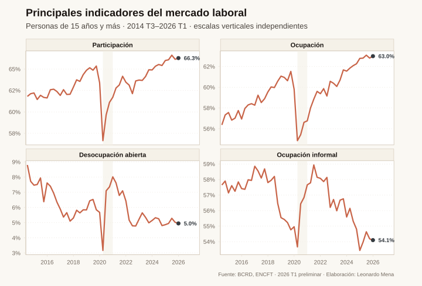

# Gráficos y datos: mercado laboral dominicano

Suite editorial reproducible para preparar artículos sin publicar contenido incompleto. Contiene figuras en SVG y PNG, tablas procesadas, consultas SQL y una capa PostgreSQL reutilizable.

## Reconstrucción de gráficos

Desde PowerShell, en la raíz del repositorio:

```powershell
powershell -ExecutionPolicy Bypass -File research/mercado-laboral-dominicano/render-graficos.ps1
```

El wrapper elimina únicamente de la sesión las variables de locale heredadas que impiden a R leer UTF-8. No crea `.Rprofile`, `.Renviron` ni cambia el locale global.

Para generar únicamente la figura de parejas desde PostgreSQL:

```powershell
$env:PG_RECOVERY_PASSWORD = '<clave>'
powershell -ExecutionPolicy Bypass -File research/mercado-laboral-dominicano/render-grafico-parejas.ps1
Remove-Item Env:PG_RECOVERY_PASSWORD
```

La salida queda en `figuras/10_similitud_parejas.{svg,png}` y sus datos exactos en `data/procesados/10_similitud_parejas.csv`.

Para calcular y generar la comparación de homogamia observada frente a la esperada bajo independencia:

```powershell
$env:PG_RECOVERY_PASSWORD = '<clave>'
powershell -ExecutionPolicy Bypass -File research/mercado-laboral-dominicano/render-grafico-homogamia-ajustada.ps1
Remove-Item Env:PG_RECOVERY_PASSWORD
```

La salida queda en `figuras/11_homogamia_ajustada.{svg,png}` y el barrido completo de doce atributos individuales en `data/procesados/11_homogamia_ajustada.csv`. Para revisar solamente el diseño sin volver a consultar PostgreSQL:

```powershell
powershell -ExecutionPolicy Bypass -File research/mercado-laboral-dominicano/render-grafico-homogamia-ajustada.ps1 -UseCache
```

Para la versión más rigurosa, condicionada por territorio, composición por sexo, unión y edades, con réplicas del Censo 2010 y ENHOGAR 2024:

```powershell
$env:PG_RECOVERY_PASSWORD = '<clave>'
powershell -ExecutionPolicy Bypass -File research/mercado-laboral-dominicano/render-grafico-homogamia-condicionada.ps1
Remove-Item Env:PG_RECOVERY_PASSWORD
```

La figura queda en `figuras/12_homogamia_condicionada.{svg,png}`. Los resultados principales y la validación se guardan en `data/procesados/12_homogamia_condicionada.csv` y `data/procesados/12_homogamia_validacion.csv`. Véase `metodologia-homogamia-condicionada.md` para fórmulas, cobertura, bootstrap y límites de interpretación.

Para validar la homogamia educativa con una encuesta pública independiente del universo censal:

```powershell
powershell -ExecutionPolicy Bypass -File research/mercado-laboral-dominicano/render-grafico-homogamia-enhogar-2022.ps1
Rscript research/mercado-laboral-dominicano/build-grafico-homogamia-enhogar-2022.R --year=2024
```

El script reconstruye hogares con exactamente una jefatura y una pareja identificable, usa el factor de expansión oficial de cada ronda, no filtra por ocupación y estima una especificación logit descriptiva con controles de región, composición por sexo, unión y edades. Genera las salidas 13 para ENHOGAR 2022 y 14 para ENHOGAR 2024. La documentación descargada de ENHOGAR 2022 y 2024, junto con sus hashes, está en `data/raw/`.

## Fuentes y cortes

- BCRD, ENCFT: 2014 T3–2026 T1. El último trimestre es preliminar.
- TSS: empleos cotizantes mensuales, junio de 2003–abril de 2026.
- ONE, X Censo Nacional 2022: microdatos y extractos auditados en PostgreSQL.

La fecha de corte de los datos se mantiene separada de la fecha técnica de extracción en `fuentes-y-cortes.csv`.

## Salidas

- `figuras/`: SVG y PNG listos para el artículo.
- `data/procesados/`: tablas exactas que alimentan cada gráfico.
- `chart-map.csv`: pregunta, familia visual, fuente, uso editorial y advertencia.
- `qa-validacion.csv`: controles de cobertura, períodos, sumas y joins.
- `sql/`: consultas para refrescar los extractos censales.
- `postgresql-recovery/`: reconstrucción, capa analítica, controles y respaldos.

## PostgreSQL

El clúster recuperado funciona en `localhost:5433` mediante el servicio automático `postgresql-x64-18-recovered`. Contiene los censos 2002, 2010 y 2022, una base federada de línea de tiempo y ENHOGAR 2024.

Para relaciones intrahogar no se usa `PHOGAR` como identificador nacional. La capa `censo_2022.analitica` reconstruye una llave estable desde la base unificada oficial y expone tablas para parejas, campos de estudio, ocupaciones y características del hogar. Consulte [la documentación de PostgreSQL](postgresql-recovery/README.md).

## Uso en Quarto

Ejemplo:

```markdown

```

Al mover las figuras al directorio final del post, conserve `build-graficos.R`, los CSV procesados y las notas de fuente como material de investigación.
